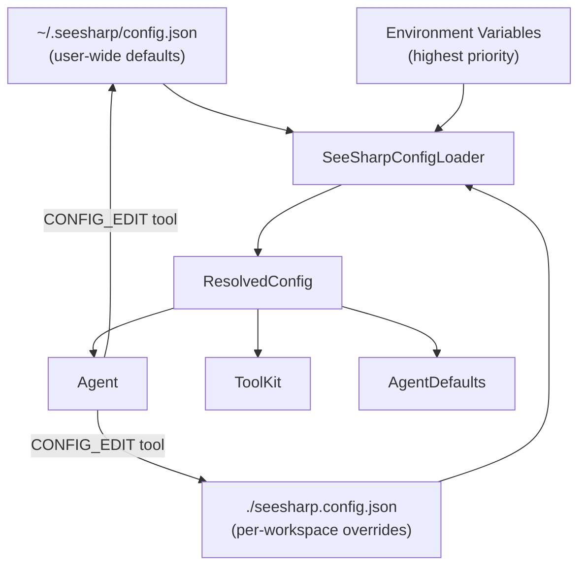

# SeeSharp Self-Customization System

## Architecture



## Layered Priority (lowest to highest)

1. **Compiled defaults** — current `AgentDefaults` values (fallback of last resort)
2. **Global config** — `~/.seesharp/config.json` (user personality, preferred models)
3. **Workspace config** — `./seesharp.config.json` in workspace root (project-specific tools, limits)
4. **Environment variables** — existing `SEESHARP_*` vars (CI/ephemeral overrides)

## New Files

### 1. `Models/SeeSharpConfig.cs` — Config data model

Defines the shape of both global and workspace config files:

```csharp
public sealed class SeeSharpConfig
{
    // Agent behavior
    public AgentLimitsConfig? Limits { get; set; }
    public SystemPromptConfig? SystemPrompt { get; set; }
    public ContextualizerConfig? Contextualizer { get; set; }
    
    // Tools
    public List<CustomToolDefinition>? CustomTools { get; set; }
    public List<string>? DisabledTools { get; set; }
    
    // UX
    public ConsoleThemeConfig? Theme { get; set; }
    
    // Identity
    public string? AgentName { get; set; }
    public string? PreferredModel { get; set; }
}
```

Key sub-models:
- `AgentLimitsConfig` — overrides for `MaxAgentTurnsPerTask`, `MaxToolCallsPerTurn`, `BashCommandTimeout`, etc.
- `SystemPromptConfig` — `Prepend`, `Append`, `Replace` sections for system prompt customization
- `CustomToolDefinition` — name, description, type (bash-script / http-endpoint), and execution template
- `ConsoleThemeConfig` — color overrides for agent output tones

### 2. `Models/SeeSharpConfigLoader.cs` — Resolution and validation

Responsibilities:
- Discovers and loads global + workspace JSON files
- Merges layers (workspace overrides global; env vars override both)
- Validates all values (e.g., timeouts > 0, tool names don't collide with builtins)
- Returns a `ResolvedConfig` with guaranteed-valid values (falls back to compiled defaults on any parse/validation failure)
- Logs warnings for invalid fields without crashing

Resilience pattern:
```csharp
public static ResolvedConfig Load(string workspaceRoot)
{
    // 1. Start with compiled defaults
    // 2. Try load global, merge (log + skip on failure)
    // 3. Try load workspace, merge (log + skip on failure)
    // 4. Apply env var overrides
    // 5. Validate and clamp all values
    return resolved;
}
```

### 3. `Models/CustomToolDefinition.cs` — User-defined tools

Users define custom tools in config that the agent can invoke:

```json
{
  "customTools": [
    {
      "name": "LINT_PROJECT",
      "description": "Runs project linter and returns findings.",
      "type": "bash",
      "command": "dotnet format --verify-no-changes --verbosity diagnostic",
      "workingDirectory": ".",
      "timeoutSeconds": 60
    },
    {
      "name": "QUERY_DB",
      "description": "Runs a read-only SQL query against the dev database.",
      "type": "bash", 
      "command": "docker compose exec -T db psql -U dev -d appdb -c \"{{query}}\"",
      "parameters": ["query"],
      "timeoutSeconds": 15
    }
  ]
}
```

Tool types supported initially:
- `bash` — shell command template with parameter interpolation
- `http` — HTTP request template (GET/POST with URL + body templates)

### 4. New Agent Tool: `CONFIG_EDIT` — Self-modification

Added to [Models/ToolKit.cs](Models/ToolKit.cs) as a new built-in tool the agent can use:

```
Tool Name: CONFIG_EDIT
Description: Reads or modifies the SeeSharp configuration for this workspace or globally.
  :param action: "read" | "set" | "append" | "remove"
  :param scope: "workspace" | "global"
  :param path: JSON path (e.g., "limits.maxAgentTurnsPerTask", "customTools[0].name")
  :param value: New value (for set/append)
  :return: Updated config section or confirmation.
```

This means a user can say "make yourself more patient with slow commands" and the agent can:
```
tool: CONFIG_EDIT({"action":"set","scope":"workspace","path":"limits.bashCommandTimeoutSeconds","value":60})
```

Safety: CONFIG_EDIT validates all writes against the schema before persisting. It refuses to disable all tools or set limits to zero/negative.

## Modifications to Existing Files

### [Models/AgentDefaults.cs](Models/AgentDefaults.cs)
- Keep as compiled fallback source
- Add a `public static ResolvedConfig ActiveConfig { get; set; }` field set during startup
- Add accessor methods that read from `ActiveConfig` first, fall back to constants

### [Models/ToolKit.cs](Models/ToolKit.cs)
- `GetToolkitInformation()` merges built-in tools + `ResolvedConfig.CustomTools`
- `ExecuteToolInvocationAsync()` gets a new case for `CONFIG_EDIT` and a generic case for custom tool dispatch
- Disabled tools (from config) are excluded from the registry string

### [Models/Agent.cs](Models/Agent.cs)
- `GenerateSystemPrompt()` incorporates `SystemPromptConfig.Prepend` / `Append` / `Replace`
- Constants like `MaxAgentTurnsPerTask` read from `ResolvedConfig.Limits` with fallback
- Constructor accepts `ResolvedConfig` (injected from Program.cs)

### [Program.cs](Program.cs)
- Early in startup: `var config = SeeSharpConfigLoader.Load(workspaceRoot);`
- Pass `config` through to Agent construction
- On first run with no config: generate a starter `seesharp.config.json` with comments

## Example Config File (generated on first run)

```json
{
  "$schema": "https://raw.githubusercontent.com/.../seesharp.config.schema.json",
  "_comment": "SeeSharp instance configuration. Edit this file or ask the agent to modify it.",
  
  "agentName": "SeeSharp",
  "preferredModel": null,
  
  "limits": {
    "maxAgentTurnsPerTask": 28,
    "maxToolCallsPerTurn": 2,
    "maxSuccessfulToolExecutionsPerTask": 22,
    "bashCommandTimeoutSeconds": 30,
    "responsesApiCallTimeoutMinutes": 10
  },
  
  "systemPrompt": {
    "prepend": null,
    "append": null,
    "replace": null
  },
  
  "contextualizer": {
    "maxFilesToRead": 15,
    "maxCharsPerFile": 48000,
    "excludedDirectories": ["bin", "obj", ".git", "node_modules"],
    "pinnedFiles": ["Program.cs"]
  },
  
  "customTools": [],
  "disabledTools": [],
  
  "theme": {
    "agentColor": "DarkCyan",
    "toolColor": "Green",
    "errorColor": "Red"
  }
}
```

## Resilience Strategy

1. **Bad JSON** — log warning, use compiled defaults entirely
2. **Partial bad values** — validate field-by-field, use default per-field on failure
3. **Missing config files** — silently use defaults (no error spam)
4. **CONFIG_EDIT conflicts** — atomic file writes (write-to-temp + rename)
5. **Schema drift** — unknown JSON keys are ignored (forward-compatible); missing keys use defaults
6. **Circular self-edits** — CONFIG_EDIT is rate-limited (max 3 per task) to prevent the agent from endlessly tweaking itself

## Deliverables

| File | Action |
|------|--------|
| `Models/SeeSharpConfig.cs` | New |
| `Models/SeeSharpConfigLoader.cs` | New |
| `Models/CustomToolDefinition.cs` | New |
| `Models/AgentDefaults.cs` | Modified — add config accessor |
| `Models/ToolKit.cs` | Modified — custom tools + CONFIG_EDIT |
| `Models/Agent.cs` | Modified — read limits/prompts from config |
| `Program.cs` | Modified — load config at startup |
| `seesharp.config.schema.json` | New — JSON schema for editor IntelliSense |
| `.env.example` | Modified — document config file relationship |
