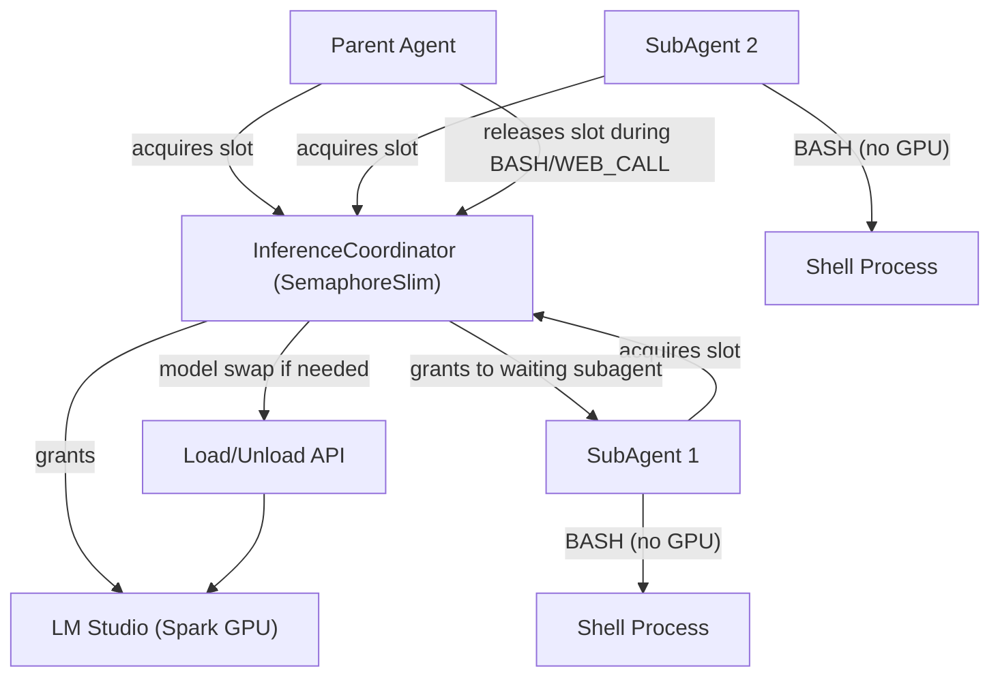
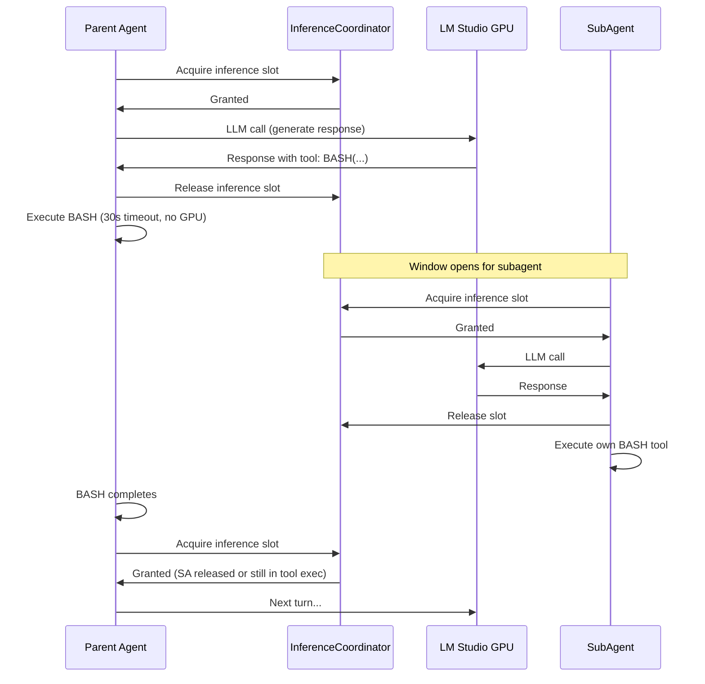

# Subagent Orchestration System

## Hardware Constraint: NVIDIA Spark + Small LLMs

The inference server (`cobec-spark:1234` / LM Studio) runs on a single NVIDIA Spark GPU with limited VRAM. This drives the entire scheduling design:

- Only ONE model can serve inference at a time (or one large + contextualizer if VRAM allows)
- Model load/unload takes 2-8 seconds -- too expensive to do per-turn
- True parallel LLM inference across agents is not possible
- BASH/WEB_CALL tool execution is GPU-free -- those are the windows where other agents can get inference

## Architecture



## Model Scheduling Strategy

Three configurable strategies. **`tieredModels` is the default** -- `sameModel` is retained only as an experiment.

**1. `tieredModels` (default, recommended)** -- Parent uses the primary model (e.g., qwen 3.6 8B), subagents use a lighter/smaller model (e.g., qwen 3.5 2B). If both fit in VRAM simultaneously, they can interleave freely. If not, the coordinator swaps models between parent turns and subagent turns (batching subagent work to amortize swap cost). This is the safest default because small models hit context limits quickly -- giving each agent its own model means each gets a fresh context window rather than competing for the same one.

**2. `dedicatedSwap`** -- Parent pauses entirely while subagents run on a different model. Subagents complete their full task, then the parent resumes. Most latency but allows using a purpose-built subagent model and guarantees no context pressure between agents.

**3. `sameModel` (experimental only)** -- All agents use the same loaded model. No swaps. Inference serialized through a semaphore. **WARNING: This is fragile on small models.** Each agent maintains its own conversation state, but limited context windows (4K-32K) mean the model is already under pressure from the parent's multi-turn loop. Subagents compound the problem -- their fresh-start contextualization still costs tokens, and the model's coherence degrades as context fills. Context overflow errors are likely under real workloads. Retained for experimentation and for cases where only one model is available, but should NOT be treated as a reliable production path.

### Why `tieredModels` over `sameModel`

Small local models (2B-8B) have tight context windows. A single agent task already consumes significant context (system prompt + repo context + tool bridge messages + cumulative tool results). The parent's conversation is already context-heavy by the time it decides to spawn subagents. With `sameModel`:
- Each agent's context grows independently but the model's capacity is fixed and small
- Context overflow recovery (compact mode, context reset) is expensive and lossy
- The model's reasoning quality degrades well before the hard limit is hit

With `tieredModels`, subagents get a fresh model instance with its own full context window. Even if the subagent model is smaller/faster (fewer parameters), it starts with a clean slate. The model swap cost (4-8s) is amortized across the subagent's entire multi-turn task -- acceptable for work that takes several tool calls to complete.

## Inference Interleaving (all strategies)

The key insight: tool execution (BASH commands, web calls) takes real wall-clock time and requires ZERO GPU. During that time, subagents can get inference slots. With `tieredModels`, model swaps happen at these boundaries too:



## New Tool Category: Subagent Tools

Three tools the parent agent can invoke:

- `SPAWN_SUBAGENT` -- Create a child agent with a task, optional workspace, optional model override. Returns an `id` immediately. The subagent begins work in the background, taking inference slots when available.
- `CHECK_SUBAGENT` -- Poll a subagent by `id`. Returns status (queued/running/completed/failed/killed), turns elapsed, and result if done.
- `KILL_SUBAGENT` -- Cancel a running subagent. Releases its inference claim and frees resources.

## Key Files to Create/Modify

### New: `Models/InferenceCoordinator.cs`

The GPU access gate. This is the critical new piece that makes subagents safe on constrained hardware.

```csharp
public sealed class InferenceCoordinator : IDisposable
{
    private readonly SemaphoreSlim _inferenceGate;
    private readonly ModelSchedulingStrategy _strategy;
    private string _currentLoadedModelId;
    private readonly Func<IReadOnlyCollection<string>, CancellationToken, Task> _keepOnlyModelsLoaded;
    private readonly string _lmStudioBaseUri;
    private readonly string _apiKey;

    // Only one agent talks to the GPU at a time
    public async Task<IDisposable> AcquireInferenceSlotAsync(
        string requestingAgentId,
        string requiredModelId,
        CancellationToken ct)
    {
        await _inferenceGate.WaitAsync(ct);
        // If model swap needed (tieredModels/dedicatedSwap), do it here
        if (!string.Equals(_currentLoadedModelId, requiredModelId, StringComparison.OrdinalIgnoreCase))
        {
            await SwapModelAsync(requiredModelId, ct);
        }
        return new SlotRelease(_inferenceGate);
    }

    // Called by Agent when entering tool execution (GPU-free window)
    public void NotifyToolExecutionStarted(string agentId) { /* metrics / priority hints */ }
    public void NotifyToolExecutionCompleted(string agentId) { /* metrics */ }
}
```

### New: `Models/SubAgentManager.cs`

Lifecycle manager that coordinates with `InferenceCoordinator`:

```csharp
public sealed class SubAgentHandle
{
    public string Id { get; init; }
    public string Task { get; init; }
    public string WorkspacePath { get; init; }
    public string ModelId { get; init; }  // which model this subagent uses
    public SubAgentStatus Status { get; set; }
    public string? Result { get; set; }
    public string? Error { get; set; }
    public int Depth { get; init; }
    public int TurnsElapsed { get; set; }
    public CancellationTokenSource Cts { get; init; }
    public Task AgentTask { get; init; }
}
```

The manager:
- Validates spawn requests (depth, concurrency, model compatibility)
- Creates child `Agent` instances with `InferenceCoordinator` injected
- Tracks which subagents are waiting for inference vs. executing tools
- Reports status including "waiting_for_inference" so the parent knows why a subagent hasn't progressed

### Modify: [`Models/Agent.cs`](Models/Agent.cs)

- Inject `InferenceCoordinator` (nullable for backward compat; null = no gating)
- `CreateResponseWithRetryAsync` wraps LLM calls in `coordinator.AcquireInferenceSlotAsync()`
- Tool execution methods call `NotifyToolExecutionStarted/Completed` to signal GPU-free windows
- Constructor accepts `depth` and `agentId` for coordinator tracking
- `GenerateSystemPrompt()` adds subagent guidance with hardware-aware advice

### Modify: [`Models/SeeSharpConfig.cs`](Models/SeeSharpConfig.cs)

New config section:
```json
{
  "subAgents": {
    "enabled": true,
    "modelStrategy": "tieredModels",
    "subAgentModelId": "qwen/qwen3.5-2b",
    "maxConcurrent": 2,
    "maxDepth": 2,
    "maxTurnsPerSubAgent": 12,
    "maxToolExecutionsPerSubAgent": 10,
    "shareRepoContext": true,
    "inferenceTimeoutSeconds": 120,
    "modelSwapTimeoutSeconds": 15
  }
}
```

### Modify: [`Models/ToolKit.cs`](Models/ToolKit.cs)

- Register SPAWN/CHECK/KILL tools in `GetToolkitInformation()`
- Dispatch in `ExecuteToolInvocationAsync()` to `SubAgentManager`
- Inject `SubAgentManager` reference

### Modify: [`Models/AgentDefaults.cs`](Models/AgentDefaults.cs)

- Add tool name constants
- Add default timeout/scheduling values

### Modify: [`Dev/LocalTestProjectMenu.cs`](Dev/LocalTestProjectMenu.cs) + [`Program.cs`](Program.cs)

- Create `InferenceCoordinator` at startup (wrapping existing `KeepOnlyModelsLoadedAsync` logic)
- Create `SubAgentManager` with coordinator reference
- Pass both into `ToolKit` / `Agent` construction

## Execution Flow (tieredModels -- default)

1. Parent agent (on primary model, e.g., qwen 3.6 8B) gets complex task
2. Parent emits: `tool: SPAWN_SUBAGENT({"task": "create SQL schema", "workspace": "./db"})`
3. `SubAgentManager.SpawnAsync`:
   - Validates limits (depth, concurrency)
   - Creates child `Agent` with **subagent model ID** (e.g., qwen 3.5 2B), shared `InferenceCoordinator`, own `ToolKit`
   - Passes parent's `repoContext` (avoids re-contextualization LLM calls on subagent)
   - Starts agent loop on `Task.Run`
   - Returns `{"subagent_id": "sa-001", "status": "queued", "model": "qwen/qwen3.5-2b"}` immediately
4. Parent continues its own work -- emits a BASH tool call
5. Parent enters tool execution (GPU-free). `InferenceCoordinator` detects idle window:
   - If subagent model differs from parent model: coordinator triggers model swap (unload parent model, load subagent model)
   - If both models fit in VRAM: no swap needed, subagent just acquires the semaphore
6. Subagent gets inference on its own fresh context window -- no context competition with parent
7. Subagent runs its tool calls (also GPU-free) -- coordinator can swap parent model back during this window
8. Parent's BASH completes. Coordinator ensures parent model is loaded. Parent acquires inference slot.
9. Parent calls `tool: CHECK_SUBAGENT({"id": "sa-001"})`:
   - Returns `{"status": "running", "turns_elapsed": 2, "model": "qwen/qwen3.5-2b"}` or `{"status": "completed", "result": "..."}`
10. Parent synthesizes subagent results into final answer

### Model swap amortization

The coordinator batches subagent inference: once it swaps to the subagent model, it runs ALL pending subagent turns (across all active subagents using that model) before swapping back. This means a 4-8s swap cost is paid once per parent tool-execution window, not once per subagent turn.

## Execution Flow (tieredModels strategy)

Same as above, but when a subagent needs inference on a different model:
1. Coordinator batches: waits for parent to enter tool execution
2. Swaps model (unload parent model, load subagent model) -- 4-8s cost
3. Runs ALL pending subagent inference turns in a burst (amortizes swap cost)
4. Swaps back to parent model when parent's tool execution is nearly done or subagents are all in tool-exec phase

## Recursion and Safety

- Subagents at `depth >= maxDepth` get NO subagent tools (prevents infinite spawn)
- Each subagent has reduced budget (turns, tool calls)
- `InferenceCoordinator` has a per-agent timeout -- if any agent holds the slot too long, it's forcibly released
- `maxConcurrent` limits total queued + running subagents
- All subagents inherit parent's `CancellationToken` chain -- Ctrl+C tears down everything
- Model swap failures (e.g., LM Studio unresponsive) gracefully degrade: subagent gets an error, parent continues

## System Prompt Guidance

The parent agent learns:
- Subagents share the same GPU -- they progress during YOUR tool execution time, not in true parallel
- Spawn subagents for independent work that takes multiple tool calls (file creation, exploration, setup)
- After spawning, prefer tool calls yourself (this creates inference windows for subagents)
- Do NOT spawn for single-command tasks -- just do them directly
- CHECK subagents after your own tool calls complete (they've likely progressed)
- KILL subagents that are stuck or no longer needed

## Implementation Order

1. `InferenceCoordinator` (semaphore + model swap logic extracted from Program.cs)
2. Config types (`SubAgentConfig` in SeeSharpConfig)
3. Refactor `Agent.CreateResponseWithRetryAsync` to use coordinator
4. `SubAgentManager` (spawn/check/kill + handle tracking)
5. ToolKit integration (register + dispatch)
6. System prompt updates
7. Depth guards
8. Harness wiring (Program.cs / LocalTestProjectMenu.cs)
9. End-to-end test with sameModel strategy
