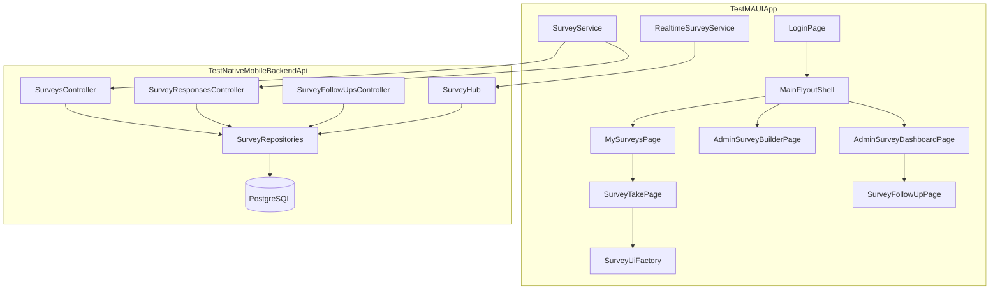

# Survey Management System Plan

## Context and constraints

The existing stack is a strong foundation but has gaps this feature must address:

| Area | Today | Implication for surveys |
|------|-------|-------------------------|
| Auth | JWT with `User` / `Admin` roles ([`AppUser.cs`](test-projects/TestNativeMobileBackendApi/Models/AppUser.cs), [`AuthorizationPolicies.cs`](test-projects/TestNativeMobileBackendApi/Configuration/AuthorizationPolicies.cs)) | Add `AdminOnly` endpoints; **enable role gating on MAUI** (role exists in [`UserProfile`](test-projects/TestMAUIApp/TestMAUIApp/Models/Api/AuthModels.cs) but is unused client-side) |
| DB | Raw PostgreSQL + SQL scripts, no EF ([`03-schema.sql`](test-projects/TestNativeMobileBackendApi/infra/postgres/03-schema.sql)) | Add `05-surveys.sql` (or extend schema file) + Npgsql repositories |
| Realtime | Single global [`ChatHub`](test-projects/TestNativeMobileBackendApi/Hubs/ChatHub.cs), broadcast-all | Add dedicated **`SurveyHub`** with admin groups + per-survey groups |
| Chat | Global room is server-backed; direct/group threads are **local SQLite only** on MAUI | Admin follow-up **must be new server-backed threads** tied to survey responses (your choice) |
| UI | Code-first [`SharedUiFactory`](test-projects/TestMAUIApp/TestMAUIApp/Ui/SharedUiFactory.cs) + [`ChatPageFactory`](test-projects/TestMAUIApp/TestMAUIApp/Services/ChatPageFactory.cs) pattern | Mirror with `SurveyUiFactory` for dynamic question rendering |

**Your decisions (locked in):**
- **Audience v1:** all authenticated users see published surveys; schema supports future per-user assignment
- **Follow-up:** server-backed threads linked to a response (+ optional question)
- **Submission:** one response per user per survey; **editable until `closes_at`**

---

## Architecture overview

---

## Domain model (PostgreSQL)

Add tables via new script [`infra/postgres/05-surveys.sql`](test-projects/TestNativeMobileBackendApi/infra/postgres/05-surveys.sql):

### Core entities

**`surveys`**
- `id`, `title`, `description`
- `allow_anonymous` (bool, default `true`) — when true, taker UI defaults to anonymous with prominent opt-in toggle
- `opens_at`, `closes_at` (unique per survey; `opens_at < closes_at`)
- `status`: `Draft` | `Published` | `Closed` (admin early-close sets `Closed`)
- `created_by` → `app_users.id`, timestamps

**`survey_questions`**
- `id`, `survey_id`, `sort_order`, `prompt`
- `question_type` enum: `Text`, `MultilineText`, `Number`, `Date`, `Time`, `Boolean`, `SingleChoice`, `MultiChoice`, `Slider`
- `is_required` (bool)
- `config_json` (JSONB): picker options, min/max/step, placeholder, max length, etc.

**`survey_responses`** — `UNIQUE (survey_id, user_id)`
- Always stores `user_id` (auth + one-response rule); anonymity is a **display flag**, not missing identity
- `is_identified` (bool): user opt-in when `allow_anonymous=true`; forced `true` when `allow_anonymous=false`
- `status`: `NotStarted` | `InProgress` | `Completed` | `CompletedLate` | `NotCompleted`
- `first_answered_at`, `last_saved_at`, `completed_at` (nullable)

**`survey_answers`**
- `response_id`, `question_id`, `value_json` (JSONB)
- `UNIQUE (response_id, question_id)`

**Future assignment (v2-ready, empty in v1):**
- `survey_assignments (survey_id, user_id)` — when rows exist, restrict visibility; when empty for a survey, treat as org-wide

### Follow-up messaging

**`survey_follow_up_threads`**
- `id`, `response_id`, `question_id` (nullable — ties thread to a specific answer)
- `status`: `Open` | `AwaitingRespondent` | `Resolved` | `Closed`
- `created_by` (admin), `subject`, timestamps

**`survey_follow_up_messages`**
- `id`, `thread_id`, `sender_id`, `message`, `sent_at`

### Status computation rules (server-authoritative)

| Status | Rule |
|--------|------|
| `NotStarted` | No answers saved |
| `InProgress` | Some answers, not all required satisfied |
| `Completed` | All required answers present and `completed_at <= closes_at` |
| `CompletedLate` | All required present but `completed_at > closes_at` (edge case if close extended mid-edit) |
| `NotCompleted` | `closes_at` passed without all required answers |

A lightweight background sweep (or computed on read + nightly SQL update) marks `NotCompleted` after close. User can **edit answers until `closes_at`**; each save upserts answers and recomputes status.

### Anonymity contract

- **Always persist** `user_id` on `survey_responses` for auth, uniqueness, and follow-up eligibility
- Admin dashboard/list/detail APIs return `respondent: null` + label `"Anonymous"` when `is_identified=false`
- Follow-up thread creation **rejected** for anonymous responses (HTTP 409)
- Admin-only endpoints never leak identity for anonymous rows

---

## Backend API surface

Follow existing controller + repository patterns ([`ChatController`](test-projects/TestNativeMobileBackendApi/Controllers/ChatController.cs), [`ChatRepository`](test-projects/TestNativeMobileBackendApi/Services/ChatRepository.cs)).

### New policy
- Keep `AdminOnly` and `ChatUser`; survey **taker** endpoints use `ChatUser`, admin CRUD/dashboard uses `AdminOnly`

### Controllers (proposed)

| Controller | Key routes | Auth |
|------------|-----------|------|
| `SurveysController` | `POST/GET/PUT /api/surveys`, `POST .../publish`, `POST .../close`, `PUT .../extend` | Admin |
| `SurveyQuestionsController` | CRUD + `PUT .../reorder` on draft surveys only | Admin |
| `SurveyResponsesController` | `GET /api/surveys/my`, `GET/PUT /api/surveys/{id}/response`, answer upsert | ChatUser |
| `SurveyDashboardController` | `GET /api/surveys/{id}/dashboard`, `GET .../responses/{id}` | Admin |
| `SurveyFollowUpsController` | create thread, list mine, get/post messages, update status | Admin + ChatUser (scoped) |

**Validation highlights:**
- Publish requires ≥1 question, valid date window
- Cannot mutate question schema after `Published` (clone-to-new-draft if edits needed later)
- Answer upsert validates required fields, question type coercion, and `opens_at <= now <= closes_at`
- Extend close date: new `closes_at > old closes_at`; broadcast via SignalR

### SignalR — `SurveyHub` at `/surveyHub`

Mirror JWT query-string auth from [`Program.cs`](test-projects/TestNativeMobileBackendApi/Program.cs) chat hub setup.

**Groups:**
- `survey-admins` — all connections with Admin role
- `survey-{surveyId}` — admins viewing a specific survey dashboard

**Server → client events:**
- `SurveyPublished`, `SurveyClosed`, `SurveyExtended`
- `ResponseUpdated` (payload: surveyId, response summary, answer snapshots for dashboard)
- `FollowUpMessageReceived`, `FollowUpStatusChanged`

**Broadcast triggers:** response save/submit, admin close/extend, follow-up message insert, status recompute.

---

## MAUI client design

### Role-aware navigation

Extend [`MainFlyoutShell`](test-projects/TestMAUIApp/TestMAUIApp/Pages/MainFlyoutShell.cs) / flyout to add sections:

**All users**
- **My Surveys** → list with filters: To complete / Completed / Missed

**Admins only** (gate on `UserProfile.Role == "Admin"`)
- **Manage Surveys** → draft + published list, create/edit builder
- **Survey Dashboard** → pick survey → live response feed

Keep existing **Chats** section unchanged.

Store current user role in [`AuthenticationService`](test-projects/TestMAUIApp/TestMAUIApp/Services/AuthenticationService.cs) after login (from `AuthResponse.User.Role`).

### `SurveyUiFactory` (core new component)

Location: [`TestMAUIApp/Ui/SurveyUiFactory.cs`](test-projects/TestMAUIApp/TestMAUIApp/Ui/SurveyUiFactory.cs)

**Responsibilities:**
- Input: `IReadOnlyList<SurveyQuestionDto>` + `SurveyResponseViewModel`
- Output: `View` tree inside a scrollable form using [`SharedUiFactory`](test-projects/TestMAUIApp/TestMAUIApp/Ui/SharedUiFactory.cs) chrome

**Control mapping (v1):**

| Question type | MAUI control | Notes |
|---------------|-------------|-------|
| Text | `Entry` | optional `Keyboard`, `MaxLength` from config |
| MultilineText | `Editor` | per [Entry/Editor docs](https://learn.microsoft.com/en-us/dotnet/maui/user-interface/controls/entry?view=net-maui-10.0) |
| Number | `Entry` + `Keyboard.Numeric` or `Stepper` | config-driven |
| Date | `DatePicker` | |
| Time | `TimePicker` | |
| Boolean | `Switch` + label | yes/no toggle |
| SingleChoice | `Picker` | options from config |
| MultiChoice | vertical `CheckBox` list | store as string array in JSON |
| Slider | `Slider` | min/max from config |

**Validation (client + server):**
- Required questions: non-empty / non-null before save
- Type-specific checks (numeric parse, date bounds, choice in allowed set)
- Show inline error labels under fields (reuse `Caption` styling in error color)

**Builder mode (admin):** reuse same factory in "preview" + separate builder controls for adding/reordering questions (admin page composes question list; factory renders preview).

### Anonymity UI (taker)

When `allow_anonymous=true`, show a top **card** with:
- Default: "You are responding anonymously" (Switch off = anonymous)
- Toggle label: "Share my identity with administrators"
- Persist `is_identified` on first save

When `allow_anonymous=false`, hide toggle; force identified.

### New services (register in [`ServiceRegistration.cs`](test-projects/TestMAUIApp/TestMAUIApp/Services/ServiceRegistration.cs))

| Service | Role |
|---------|------|
| `SurveyService` | REST calls via `AuthenticationService.ExecuteAuthorizedAsync` |
| `SurveyResponseService` | load/save answers, list "my surveys" |
| `RealtimeSurveyService` | SignalR hub client, events → UI refresh |
| `SurveyPageFactory` | wire pages with DI (mirror `ChatPageFactory`) |

### New pages (code-first, transient DI)

| Page | Purpose |
|------|---------|
| `MySurveysPage` | User survey inbox with status badges |
| `SurveyTakePage` | Dynamic form + save; edit until close |
| `AdminSurveyListPage` | CRUD entry, publish/close/extend actions |
| `AdminSurveyBuilderPage` | Question editor + live preview via `SurveyUiFactory` |
| `AdminSurveyDashboardPage` | Live `CollectionView` of responses; tap → detail |
| `SurveyResponseDetailPage` | Admin view of one response; "Start follow-up" if identified |
| `SurveyFollowUpPage` | Thread UI for admin ↔ identified taker |

### Realtime dashboard UX

- Admin opens dashboard → `RealtimeSurveyService` joins `survey-{id}` group
- On `ResponseUpdated`, upsert row in observable collection (match by response id)
- Show aggregate header: total responses, completion %, anonymous vs identified counts
- Status badge colors aligned with [`AppPalette`](test-projects/TestMAUIApp/TestMAUIApp/Ui/AppPalette.cs)

---

## Gaps you had not specified (included in plan)

1. **Draft → Publish workflow** — surveys are editable only in `Draft`; publishing locks schema
2. **Question reordering** — drag or up/down in builder; persisted as `sort_order`
3. **No duplicate submissions** — DB unique constraint + API 409
4. **Admin cannot follow up anonymous respondents** — enforced server-side with clear UI disable
5. **Close vs extend** — close sets `status=Closed` immediately; extend only moves `closes_at` forward
6. **Missed surveys** — `NotCompleted` visible in user history after close
7. **Server-side anonymity filtering** — never trust client to hide identity on admin routes
8. **Smoke test doc update** — extend [`full-stack-smoke-test.md`](test-projects/TestMAUIApp/docs/full-stack-smoke-test.md) with admin + user flows

**Deferred (post-v1):** per-user assignment UI, export CSV, survey templates/cloning, push notifications, Razor admin web dashboard.

---

## Implementation phases

### Phase 1 — Backend foundation
- SQL schema + grants in `05-surveys.sql`
- POCOs in `Models/Surveys/`
- Repositories: `SurveyRepository`, `SurveyResponseRepository`, `SurveyFollowUpRepository`
- `SurveysController` + `SurveyResponsesController` (CRUD, publish, my-list, answer upsert)
- Status computation helper
- Unit/integration tests against Postgres (follow existing test patterns if any)

### Phase 2 — MAUI taker flow
- API DTOs in `Models/Api/Survey*.cs`
- `SurveyService`, `SurveyUiFactory`, `MySurveysPage`, `SurveyTakePage`
- Role-agnostic flyout entry "My Surveys"
- Client validation + save/edit-until-close

### Phase 3 — Admin builder + lifecycle
- Admin flyout sections (role gate)
- `AdminSurveyListPage`, `AdminSurveyBuilderPage`
- Publish / close / extend API integration
- Builder: add/edit/delete/reorder questions with type picker

### Phase 4 — Realtime dashboard
- `SurveyHub` + `RealtimeSurveyService`
- `AdminSurveyDashboardPage` with live updates
- `SurveyResponseDetailPage` with anonymity-aware display

### Phase 5 — Follow-up messaging
- `SurveyFollowUpsController` + hub events
- `SurveyFollowUpPage` for admin and taker
- Thread status transitions (`Open` → `AwaitingRespondent` → `Resolved`)
- Link from dashboard detail to pre-filled thread (optional `question_id`)

---

## Key files to create/modify

**Backend (new):**
- `infra/postgres/05-surveys.sql`
- `Hubs/SurveyHub.cs`
- `Controllers/SurveysController.cs`, `SurveyResponsesController.cs`, `SurveyDashboardController.cs`, `SurveyFollowUpsController.cs`
- `Services/SurveyRepository.cs` (+ interfaces)
- `Models/Surveys/*.cs`

**Backend (modify):**
- [`Program.cs`](test-projects/TestNativeMobileBackendApi/Program.cs) — map `/surveyHub`, register repos

**MAUI (new):**
- `Ui/SurveyUiFactory.cs`
- `Services/SurveyService.cs`, `SurveyResponseService.cs`, `RealtimeSurveyService.cs`, `SurveyPageFactory.cs`
- `Pages/MySurveysPage.cs`, `SurveyTakePage.cs`, `AdminSurvey*.cs`, `SurveyFollowUpPage.cs`
- `Models/Api/SurveyModels.cs`

**MAUI (modify):**
- [`ServiceRegistration.cs`](test-projects/TestMAUIApp/TestMAUIApp/Services/ServiceRegistration.cs)
- [`NavigationService.cs`](test-projects/TestMAUIApp/TestMAUIApp/Services/NavigationService.cs) — survey navigation methods
- [`MainFlyoutShell.cs`](test-projects/TestMAUIApp/TestMAUIApp/Pages/MainFlyoutShell.cs) / new flyout hub page — role-aware menu
- [`AuthenticationService.cs`](test-projects/TestMAUIApp/TestMAUIApp/Services/AuthenticationService.cs) — expose role

---

## Test plan (manual, v1)

1. Login as `admin` / `Password1!` → create draft survey with mixed question types → publish
2. Login as `demo` → see survey in "To complete" → fill anonymously → save → edit answers before close
3. Login as `admin` → dashboard updates live on demo saves → anonymous row shows no identity
4. Demo opts into identified → admin starts follow-up on a question → both sides exchange messages; status updates
5. Admin closes survey early → demo can no longer save; admin extends close → demo can edit again
6. After close with incomplete required field → demo sees `NotCompleted`; complete before close → `Completed`
